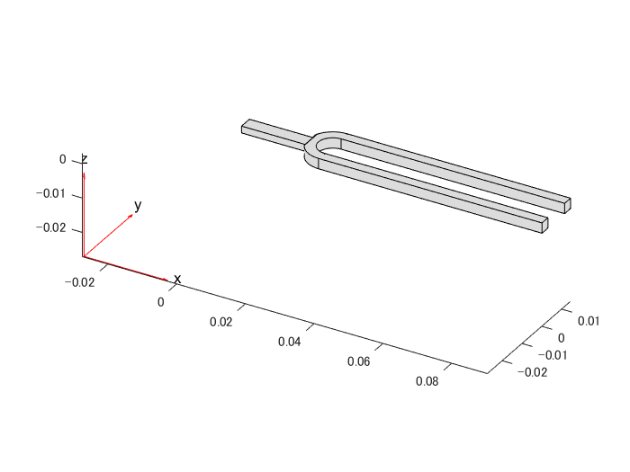

# 音叉の構造力学.


音叉のモード解析と過渡解析を行います。音叉はいわば U字型のビームです。その２つのビームのいずれかを叩くと基本（最初の）周波数で振動し可聴音を生成します。


音叉の第１モードは対称的な振動によって特徴づけられる：基部で力のバランスをとりながら、同時に互いに向かって振動する。基本振動モードでは、交差部に取り付けられたハンドルに曲げ効果は生じない。ベースでの曲げがないことで、そのダイナミクスに影響を与えることなく音叉の簡単な操作を可能にします。


ビームの横振動によりハンドルは基本周波数で軸方向に振動します。この軸方向の振動を利用して、ハンドルの端部を金属製のテーブルの天板のような大きな表面積に接触させることで、可聴音を増幅させることができます。対称モード形状を有する次の高次モードは、基本周波数の約6.25倍。したがって、適切に励起された音叉は、基本周波数に対応する支配的な周波数で振動し、純粋な可聴音を発生させる傾向がある。この例では、このような音叉のダイナミクスを、モーダル解析と過渡ダイナミクスシミュレーションに再現しています。


ヘルパー関数 `animateSixTuningForkModes `と `tuningForkFFT `とジオメトリファイル `TuningFork.stl` は `matlab/R20XXx/examples/pde/main` の下にあります。


# 音叉のモーダル解析


音叉の基本モードとそれに続くいくつかのモードの固有振動数とモード形状を求めます。そして基本周波数でのフォークハンドルの曲げ効果がないことを確認しましょう。


まず、固体音叉のモード解析のための構造モデルを作成します。


```matlab:Code
model = createpde('structural','modal-solid');
```


構造物の非拘束モーダル解析を行うには、ジオメトリ、メッシュ、材料特性を指定するだけで十分です。まず、音叉のジオメトリをインポートしてプロットします。


```matlab:Code
importGeometry(model,'TuningFork.stl');
figure
pdegplot(model)
```





線形弾性体の挙動をモデル化するために、ヤング率、ポアソン比、質量密度を指定します。すべての物性を一貫した単位で指定してください。


```matlab:Code
E = 210E9;
nu = 0.3;
rho = 8000;
structuralProperties(model,'YoungsModulus',E, ...
                           'PoissonsRatio',nu, ...
                           'MassDensity',rho);
```


メッシュを生成します。


```matlab:Code
generateMesh(model,'Hmax',0.001);
```

# 選択した周波数範囲でモデルを解く


ゼロに近い周波数を持つすべてのモードが解に現れるように、ゼロ以下の周波数下限を指定します。


```matlab:Code
RF = solve(model,'FrequencyRange',[-1,4000]*2*pi);
```

# 結果の表示


デフォルトでは、ソルバーは角周波数を返します。


```matlab:Code
modeID = 1:numel(RF.NaturalFrequencies);
```


で割って得られた周波数を Hz で表示します。


```matlab:Code
tmodalResults = table(modeID.',RF.NaturalFrequencies/2/pi);
tmodalResults.Properties.VariableNames = {'Mode','Frequency'};
disp(tmodalResults);
```


```text:Output
    Mode    Frequency
    ____    _________

      1     0.0077799
      2     0.0034067
      3     0.0020254
      4     0.0031827
      5      0.006891
      6       0.01048
      7        460.42
      8        706.34
      9        1911.5
     10        2105.5
     11        2906.5
     12        3814.7
```


この例では境界制約がないため、モード結果には剛体モードが含まれます。最初の 6 つのゼロに近い周波数は剛体モードを示しています。第1のフレキシブルモードは、460Hz付近の周波数を持つ第7のモードです。


# 結果のアニメーションを作成


モードの形状を視覚化する最良の方法はそれぞれの周波数でのハーモニックな動きをアニメーション化することです。`animateSixTuningForkModes` 関数は、モーダル結果RFのモード7から12までの6つの柔軟なモードをアニメーション化します。


```matlab:Code
frames  = animateSixTuningForkModes(RF);
```


アニメーションを再生するには、以下のコマンドを使用します。


`movie(figure('units','normalized','outerposition',[0 0 1 1]),frames,5,30)`


最初のモードでは、音叉の２つの振動するビームがハンドルの横方向の力をバランスさせる。この効果を有する次のモードは、周波数2906.5Hzの第5のフレキシブルモードである。この周波数は、基本周波数460Hzの約6.25倍である。


# 音叉の過渡解析


音叉の歯の一つ叩いたときの動的挙動をシミュレーションします。経時的の振動とハンドルの軸方向の振動を解析します。


まず、構造的な過渡解析モデルを作成します。


```matlab:Code
tmodel = createpde('structural','transient-solid');
```


モーダル解析に使用したのと同じチューニングフォークジオメトリをインポートします。


```matlab:Code
importGeometry(tmodel,'TuningFork.stl');
```


メッシュを作成します。


```matlab:Code
mesh = generateMesh(tmodel,'Hmax',0.005);
```


ヤング率、ポアソン比、質量密度を指定します。


```matlab:Code
structuralProperties(tmodel,'YoungsModulus',E, ...
                            'PoissonsRatio',nu, ...
                            'MassDensity',rho);
```


面のラベルでジオメトリをプロットすることで、境界制約と荷重を適用するための面を特定します。


```matlab:Code
figure('units','normalized','outerposition',[0 0 1 1])
pdegplot(tmodel,'FaceLabels','on')
view(-50,15)
title 'Geometry with Face Labels'
```


適用された負荷の下で剛体運動を避けるために境界制約を課します。典型的には、音叉を手で持ったりテーブルに取り付けたりしますが、この境界条件を簡略化し、ビームとハンドルの交点付近（面２１、２２）を固定することにします。


```matlab:Code
structuralBC(tmodel,'Face',[21,22],'Constraint','fixed');
```


基本モードの時間周期のごくわずかな時間だけ圧力負荷をかけることで、インパルス負荷を近似させます。この非常に短い圧力パルスを用いることで、音叉の基本モードのみが励起されることを保証します。基本モードの期間Tを評価するには、モーダル解析の結果を利用します。


```matlab:Code
T = 2*pi/RF.NaturalFrequencies(7);
```


圧力負荷を短い矩形の圧力パルスとして指定します。


```matlab:Code
structuralBoundaryLoad(tmodel,'Face',11,'Pressure',5E6,'EndTime',T/300);
```


ゼロ変位とゼロ速度を初期条件として適用します。


```matlab:Code
structuralIC(tmodel,'Displacement',[0;0;0],'Velocity',[0;0;0]);
```


Solve the transient model for 50 periods of the fundamental mode. Sample the dynamics 60 times per period of the fundamental mode.


基本モード 50 周期分の過渡モデルを解き、基本モード 1 周期あたり 60 回サンプルします。


```matlab:Code
ncycle = 50;
samplingFrequency = 60/T;
tlist = linspace(0,ncycle*T,ncycle*T*samplingFrequency);
R = solve(tmodel,tlist);
```

# 先端の動きを可視化


面12である先端の振動を時系列でプロットします。先端面上の節点を見つけ、これらの節点の一つを用いて、経時的な変位のy成分をプロットします。


```matlab:Code
excitedTineTipNodes = findNodes(mesh,'region','Face',12);
tipDisp = R.Displacement.uy(excitedTineTipNodes(1),:);

figure
plot(R.SolutionTimes,tipDisp)
title('Transverse Displacement at Tine Tip')
xlim([0,0.1])
xlabel('Time')
ylabel('Y-Displacement')
```


音叉の振動周波数が基本周波数に近いことを確認するために、先端変位時系列に高速フーリエ変換(FFT)を行います。制約のないモーダル解析で計算された基本周波数からの小さなズレは、過渡解析で課せられた制約のために現れます。


```matlab:Code
[fTip,PTip] = tuningForkFFT(tipDisp,samplingFrequency);
figure
TF = islocalmax(PTip,'MaxNumExtrema',6);
plot(fTip,PTip,fTip(TF),PTip(TF),'r*') 
title({'Single-sided Amplitude Spectrum', 'of Tip Vibration'})
xlabel('f (Hz)')
ylabel('|P1(f)|')
xlim([0,4000])
```


横振動により、ハンドルは同じ周波数で軸方向に振動します。この振動を観察するには、ハンドルの端面の軸方向変位を時系列でプロットします。


```matlab:Code
baseNodes = tmodel.Mesh.findNodes('region','Face',6);
baseDisp = R.Displacement.ux(baseNodes(1),:);
figure
plot(R.SolutionTimes,baseDisp)
title('Axial Displacement at the End of Handle')
xlim([0,0.1])
ylabel('X-Displacement')
xlabel('Time')
```


ハンドルの軸振動の時系列のFFTを行うと、振動周波数が基本周波数に近いことが分かります。


```matlab:Code
[fBase,PBase] = tuningForkFFT(baseDisp,samplingFrequency);
figure
TFb = islocalmax(PBase,'MaxNumExtrema',6);
plot(fBase,PBase,fBase(TFb),PBase(TFb),'r*') 
title({'Single-sided Amplitude Spectrum', 'of Base Vibration'})
xlabel('f (Hz)')
ylabel('|P1(f)|')
xlim([0,4000])
```


Copyright 2018 The MathWorks, Inc.


