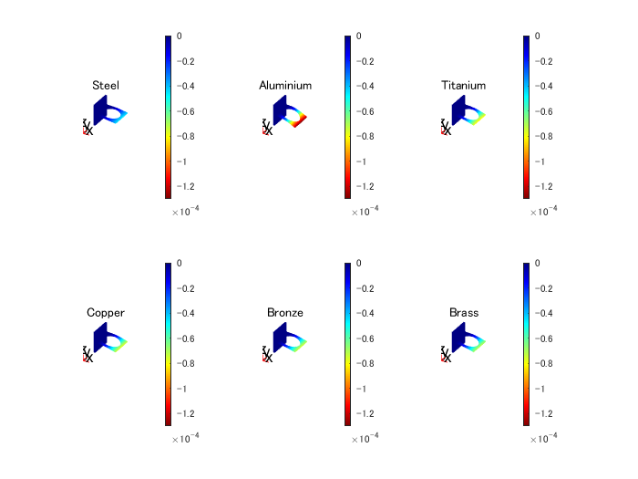
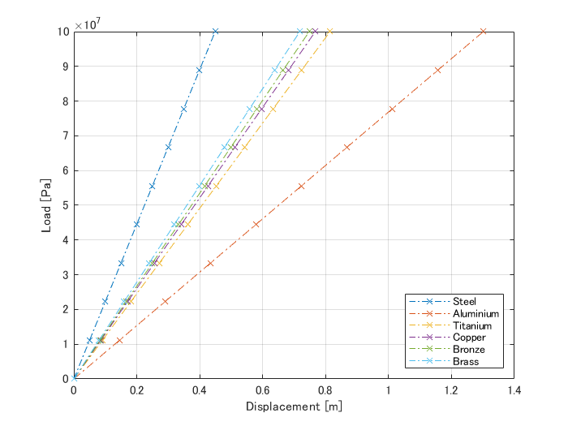

# 複数材料のブラケットのたわみ解析


この例では、材料特性のパラメータスイープを実行して、与えられた荷重によるたわみが最小となる材料を決定する方法を示します。最後に、そのような材料について、荷重たわみ曲線を計算します。この解析では、並列計算を利用してシミュレーション結果を高速化しています。解析手法の詳細については、「ブラケットのたわみ解析」を参照してください。


# 材料のプロパティをインポートして問題を定義


解析対象の材料のテキストファイルからパラメータをインポートします。また、並列化を利用して計算を行うため、[並列プール](https://www.mathworks.com/help/distcomp/run-code-on-parallel-pools.html)を起動します。


```matlab:Code
clear
gcp;
```


```text:Output
'local' プロファイルを使用して並列プール (parpool) を起動中...
並列プールに接続済み (ワーカー数: 4)。
```


```matlab:Code
material_parameters = readtable('Materials_ParametersList.txt','ReadVariableNames',false,'HeaderLines',1);
material_parameters.Properties.VariableNames = {'Material','YoungsModulus','PoissonsRatio'};
material_parameters.Properties.VariableUnits = {'','GPa',''} % Keep track of units on our table
```

| |Material|YoungsModulus|PoissonsRatio|
|:--:|:--:|:--:|:--:|
|1|'Steel'|200.0000|0.3000|
|2|'Aluminium'|69.0000|0.3200|
|3|'Titanium'|110.3000|0.2700|
|4|'Copper'|117.0000|0.3300|
|5|'Bronze'|120.0000|0.3400|
|6|'Brass'|125.0000|0.3400|


```matlab:Code

idx_max = size(material_parameters,1); % Number of materials to consider
distributedLoad = 1e4; % Applied load in Pascals
bracketThickness = 1e-2; % Thickness of horizontal plate with hole, meters

Model = cellfun(@(~) createpde('structural','static-solid'),material_parameters.Material,'UniformOutput',false);
YoungMV = material_parameters.YoungsModulus*1e9; % GPa 
PoissR = material_parameters.PoissonsRatio;
```

# 構造解析モデルを作成し求解


線形弾性問題を解く最初のステップは、構造解析モデルを作成することです。これは、ジオメトリ、構造材料の特性、ボディと境界荷重、境界制約、メッシュを保持するコンテナです。このステップを [parfor](https://www.mathworks.com/help/distcomp/parallel-for-loops-parfor.html) を使用してすべての材料について実行し、すべての材料の解を並列に計算します。tic/tocを用いてforとparforの解の時間を比較します。


```matlab:Code
pb = cell(1,idx_max);
results = cell(1,idx_max);

parfor ii = 1:idx_max
    pb{ii} = setupFEA(Model{ii},YoungMV(ii),PoissR(ii),distributedLoad);
    results{ii} = solve(pb{ii});    
end
```

# 解の検証


  方向のブラケットの最小たわみ量を求めます


```matlab:Code
minUz = cellfun(@(x) min(x.Displacement.uz),results);
[mUz,Imin] = max(minUz);
fprintf(['The material with the minimum deflection in the z-direction is '...
    material_parameters.Material{Imin} ' with ' num2str(mUz) ' m']);
```


```text:Output
The material with the minimum deflection in the z-direction is Steel with -4.4895e-05 m
```


```matlab:Code
material_parameters.Max_Deflection = abs(minUz)' % Append deflection values to our table
```

| |Material|YoungsModulus|PoissonsRatio|Max_Deflection|
|:--:|:--:|:--:|:--:|:--:|
|1|'Steel'|200.0000|0.3000|4.4895e-05|
|2|'Aluminium'|69.0000|0.3200|1.3010e-04|
|3|'Titanium'|110.3000|0.2700|8.1412e-05|
|4|'Copper'|117.0000|0.3300|7.6708e-05|
|5|'Bronze'|120.0000|0.3400|7.4772e-05|
|6|'Brass'|125.0000|0.3400|7.1781e-05|

# 全材料のZ変位をプロット


解を可視化するには、解のベクトルの成分をプロットします。最大のたわみは -方向にあります。同じカラーバーの範囲を使用して、すべての解を比較しています。たわみが最も小さい材料と最も大きい材料の色の違いに注目してください。


```matlab:Code
for jj = 1:idx_max
    subplot(2,3,jj)
    h = pdeplot3D(pb{jj},'ColorMapData',results{jj}.Displacement.uz,...
        'Deformation',results{jj}.Displacement,'DeformationScaleFactor',5e2);
    cm = colormap(gca,jet);
    colormap(gcf,flip(cm));
    caxis(gca,[min(minUz) 0])
    title(material_parameters.Material(jj))
end
```




# 荷重/たわみ曲線の計算


各材料の荷重たわみ曲線を計算します。[100,100e6] Pa の範囲で 10 種類の荷重について、すべての材料をループします。つまり、合計 60 種類のモデルがあります。すべての材料パラメータと荷重の組み合わせを1つのループで繰り返し計算するには、meshgridを使用します。


```matlab:Code
F_Load = linspace(1e2,1e8,10);
F_Load_size = size(F_Load,2);
[X,Y] = meshgrid(1:idx_max,F_Load); 
lD_result = nan(F_Load_size,idx_max);

parfor ii = 1:numel(X)
   mdl = pb{X(ii)};
   lD_result(ii) = solveLD(mdl,Y(ii)); 
end
```

# すべての材料の曲線を可視化

```matlab:Code
figure
plot(lD_result,F_Load,'-.x')
xlabel('Displacement [m]')
ylabel('Load [Pa]')
legend(material_parameters.Material,'Location','southeast')
grid on;
```




# ヘルパー関数


荷重たわみモデルの問題を組み立て、求解するためのヘルパー機能


```matlab:Code
function modelN = setupFEA(modelN,YoungM,PoissonR,distrL)
    modelN.Geometry = importGeometry(modelN,'BracketWithHole.stl');
    structuralProperties(modelN,'Cell',1,'YoungsModulus',YoungM,'PoissonsRatio',PoissonR);
    structuralBC(modelN,'Face',4,'Constraint','fixed');
    structuralBoundaryLoad (modelN,'Face',8,'SurfaceTraction',[0;0;-distrL]);
    bracketThickness = 1e-2; % Thickness of horizontal plate with hole, meters
    generateMesh(modelN,'Hmax',bracketThickness);
end

function ld_mat = solveLD(modelM,ldm)
structuralBoundaryLoad (modelM,'Face',8,'SurfaceTraction',[0;0;-ldm]);
ld_result = solve(modelM);
ld_mat = abs(min(ld_result.Displacement.uz));
end
```


*Copyright 2014-2018 The MathWorks, Inc.*


